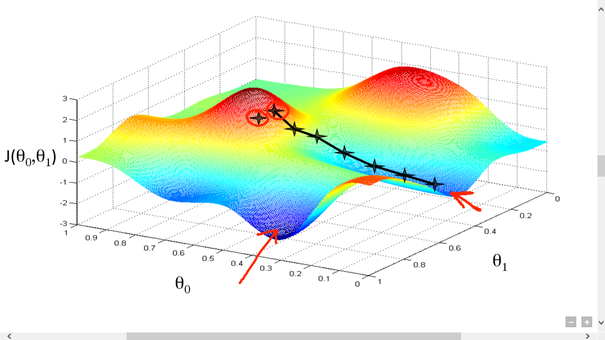
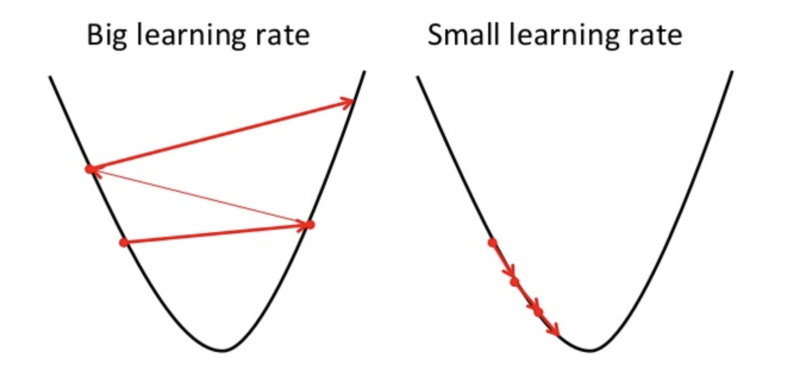

#  线性回归

## Jupyter示例

▶️ [示例|单一变量的线性回归]() - 通过`GDP`来预测`国家幸福指数`

▶️ [示例|多变量的线性回归]()- 通过`GDP`和`自由度`来预测`国家幸福指数`

▶️ [示例|非线性回归]()- 通过`多项式`和`正弦函数`特点的线性回归来预测非线型关系

##  定义

**线性回归**就是一个线性模型，比如：在一个模型中，如果输入变量(x)和单个的输出变量（y）存在线性关系，更准确来说，如果输出变量（y）可以通过一系列输入变量（x）的线性组合来计算得到，那么我们就称这种模型为线性模型。

例如，上图中的输入变量x和输出变量y之间就存在一种依赖。上图中的红线就表示最佳拟合直线。基于给出的数据点（训练样本），我们尝试用一条直线来尽力拟合点的分布。在真实的场景中，我们通常需要用到多个输入变量来拟合。

## 特征（变量）

每一个训练样本都由描述样本的特征（变量）（比如：房间数，房间面积，等等）组成。

n - 特征数

_Rn+1_ - _n+1_ 个实数组成的矢量

##参数

参数，是我们为了预测，而希望我们的算法可以学习获得的假定式的参数。（比如：预测房间的价格）。

##假定式

假定式就是，一个以特征变量和参数作为输入，预测值作为输出的等式。（比如：基于房间大小和房间数量来预测房子的价格）

为了方便，我们定义 _X0 = 1_

##损失函数

损失函数用来表示以当前参数集合的参数的假定式预测结果的准确度。

_xi_  -  第_i_次训练样本的输入（特征）

_yi_  - 第_i_次训练样本的输出

_m_ - 训练样本的个数

## 批量梯度下降算法

梯度下降是一种用来寻找最小损失函数的迭代优化算法。查找局部最小损失函数使用梯度下降算法，以当前点函数的负梯度的一定比例的步数进行逼近。

下图表示我们从函数高点出发找到局部最小值的步骤。

梯度下降的方向由当前点的损失函数的导数决定。

当我们决定了下降的方向后，我们还需要知道下降的步长是多少。

我们需要根据对应梯度下降方向和步长来同时更新( _j = 0, 1, ..., n_)。

为学习速率，一个决定梯度下降步长大小的常数

 - 第 _i_ 个训练样本中的第 _j_ 个特征值

 - 第 _i_ 个训练样本的输入（特征）

 _yi_    - 第 _i_  个训练样本的输出

_m_    - 训练样本的个数 

_n_     - 特征的个数

> `批量梯度下降`中的批量，指的是算法中每一步都会使用到全部的训练样本数据（我们也可以从上述公式中可以看出）。

## 特征缩放

为了使线性回归和梯度下降算法正常工作，我们还需要确保所有的特征数据都在同一个数值范围内。

比如，"房子大小" 的特征（假设房子大小120m2）就比 "房间数量" （假设房间数量为2）的特征远远要大。

为了保证特征数据都处于同一个数值范围内，我们需要对特征数据进行**均值归一化**处理。

 - 第 _i_ 个训练样本的第 _j_  个特征值

  - 训练样本集中的第 _j_ 个特征的平均值

   - 训练样本集中的第 _j_ 个 特征值的大小范围 （最大值-最小值）

## 多项式回归

多项式回归是通过 _n_ 阶 _x_ 的多项式用来表示独立变量 _x_ 和非独立变量 _y_ 的关系的回归分析。 