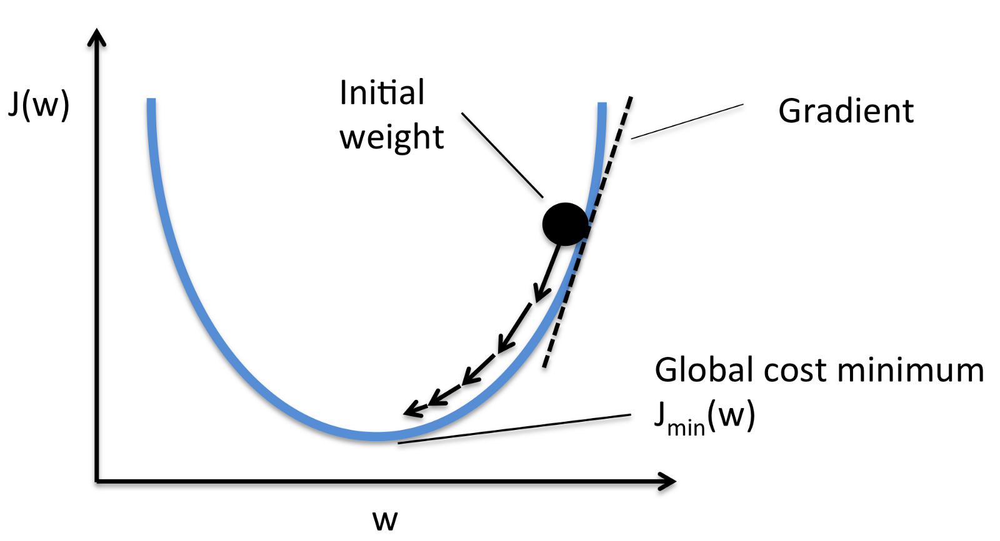

#  线性回归

## Jupyter示例

▶️ [示例|一元线性回归](https://nbviewer.jupyter.org/github/trekhleb/homemade-machine-learning/blob/master/notebooks/linear_regression/univariate_linear_regression_demo.ipynb) - 通过`GDP`预测`国家幸福指数`

▶️ [示例|多元线性回归](https://nbviewer.jupyter.org/github/trekhleb/homemade-machine-learning/blob/master/notebooks/linear_regression/multivariate_linear_regression_demo.ipynb)- 通过`GDP`和`自由度`预测`国家幸福指数`

▶️ [示例|非线性回归](https://nbviewer.jupyter.org/github/trekhleb/homemade-machine-learning/blob/master/notebooks/linear_regression/non_linear_regression_demo.ipynb)- 利用带有`多项式`和`正弦函数`特征的线性回归来预测非线型关系

##  定义

**线性回归** 是一种线性模型，表示输入变量(x)和单个的输出变量（y）存在线性关系，更确切的来说，输出变量（y）可以通过计算一系列输入变量（x）的线性组合得到。

上图中，输入变量x和输出变量y之间存在一种依赖。图中的红线表示最佳拟合直线。基于已有的数据点（训练样本），我们用一条直线尽可能地拟合点的分布。在真实的场景中，我们一般有多个输入变量。

## 特征（变量）

每一组训练样本都由描述样本的特征（变量）（比如：房间数，房间面积，等等）组成。

n - 特征数

_Rn+1_ - _n+1_ 个实数组成的矢量

## 参数

参数，是我们为了预测，而希望我们的算法可以学习获得的假定式的参数。（比如：预测房间的价格）。

## 假定式

假定式就是，一个以特征变量和参数作为输入，预测值作为输出的等式。（比如：基于房间大小和房间数量来预测房子的价格）

为了方便，我们定义 _X0 = 1_

##损失函数

损失函数用来表示以当前参数集合的参数的假定式预测结果的准确度。

_xi_  -  第_i_次训练样本的输入（特征）

_yi_  - 第_i_次训练样本的输出

_m_ - 训练样本的个数

## 批量梯度下降算法

梯度下降是一种用来寻找最小损失函数的迭代优化算法。查找局部最小损失函数使用梯度下降算法，以当前点函数的负梯度的一定比例的步数进行逼近。

下图表示我们从函数高点出发找到局部最小值的步骤。

梯度下降的方向由当前点的损失函数的导数决定。

当我们决定了下降的方向后，我们还需要知道下降的步长是多少。

我们需要根据对应梯度下降方向和步长来同时更新( _j = 0, 1, ..., n_)。

为学习速率，一个决定梯度下降步长大小的常数

 - 第 _i_ 个训练样本中的第 _j_ 个特征值

 - 第 _i_ 个训练样本的输入（特征）

 _yi_    - 第 _i_  个训练样本的输出

_m_    - 训练样本的个数 

_n_     - 特征的个数

> `批量梯度下降`中的批量，指的是算法中每一步都会使用到全部的训练样本数据（我们也可以从上述公式中可以看出）。

## 特征缩放

为了使线性回归和梯度下降算法正常工作，我们还需要确保所有的特征数据都在同一个数值范围内。

比如，"房子大小" 的特征（假设房子大小120m2）就比 "房间数量" （假设房间数量为2）的特征远远要大。

为了保证特征数据都处于同一个数值范围内，我们需要对特征数据进行**均值归一化**处理。

 - 第 _i_ 个训练样本的第 _j_  个特征值

  - 训练样本集中的第 _j_ 个特征的平均值

   - 训练样本集中的第 _j_ 个 特征值的大小范围 （最大值-最小值）

## 多项式回归

多项式回归是以 _x_ 的_n_ 阶多项式来表示独立变量 _x_ 和非独立变量 _y_ 的关系的回归分析的一种方式。 

尽管多项式回归用来拟合非线性模型数据，但是作为一个统计估计问题来说，多项式回归是线性的。因为，某种意义上来说，多项式回归的假定式是一个未知参数从数据中估计而来的线性函数。所以，多项式回归被认为一个多元线性回归的一种特殊形式。

​                                            示例：三元多项式回归-线性回归的一种类型

你可以通过添加新的多项式特征来创建多项式回归，比如，如果房子的价格和它的大小有非线性依赖，你可以添加一些新的大小相关的特征。

#### 正规方程

线性回归存在一个如下的[解析解（封闭解）](https://zh.wikipedia.org/wiki/解析解)：

使用这个公式不需要任何的特征缩放操作，你并不需要像梯度下降一样循环计算直到收敛来计算才能得到结果，而只需要进行一步计算就可以获得一个确切的解。

#### 正规化

##### 过度拟合问题

如果，我们有很多的特征，学习的假定式或许能很好的拟合训练数据集：

但是无法推广到新数据集（让我们以检测新邮件是否为垃圾邮件为例来预测价格）

#### 过度拟合的解决方法

这里有两种方法可以用来解决过度拟合问题：

+ 减少特征数目
  + 人工选择保存哪些特征
  + 模型选择算法
+ 正规化
  + 保存所有的特征，但是降低模型参数值/量级（$$\theta$$）。
  + 当我们有很多特征，并且每个特征都分别和 __y__ 相关联的时候，这种方法比较好。

正规化方法通过给 **损失函数** 添加正规化参数来避免过度拟合：

> 注意：你不应该正规化参数 $$\theta_0$$ 。

$$\lambda$$ -正规化参数

**梯度下降** 公式如下：

### 引用

- [Machine Learning on Coursera](https://www.coursera.org/learn/machine-learning)
- [Linear Regression on Wikipedia](https://en.wikipedia.org/wiki/Linear_regression)
- [Gradient Descent on Wikipedia](https://en.wikipedia.org/wiki/Gradient_descent)
- [Gradient Descent by Suryansh S.](https://hackernoon.com/gradient-descent-aynk-7cbe95a778da)
- [Gradient Descent by Niklas Donges](https://towardsdatascience.com/gradient-descent-in-a-nutshell-eaf8c18212f0)
- [Overfitting on GeeksForGeeks](https://www.geeksforgeeks.org/underfitting-and-overfitting-in-machine-learning/)