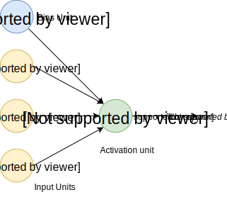
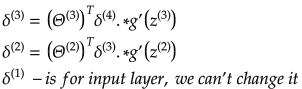

# 神经网络 Neural Network

## Jupyter Demos

▶️ [Demo | 多层感知机 Multilayer Perceptron | MNIST](https://nbviewer.jupyter.org/github/MLEveryday/homemade-machine-learning/blob/master/notebooks/neural_network/multilayer_perceptron_demo.ipynb) - 从 `28x28` 像素图片中识别手写数字 。

▶️ [Demo | 多层感知机 Multilayer Perceptron | Fashion MNIST](https://nbviewer.jupyter.org/github/MLEveryday/homemade-machine-learning/blob/master/notebooks/neural_network/multilayer_perceptron_fashion_demo.ipynb) - 从 `28x28`  像素图片中识别衣服类型（裙子，外套，凉鞋等）。

## 定义 Definition

人工神经网络 **Artificial neural networks** (ANN) 或 连接系统都是灵感来自组成动物大脑生物神经网络的计算系统。神经网络本身不是一个算法，而是一个框架，很多不同机器学习算法一起工作，处理复杂的数据输入。这些系统通过例子“学习”解决任务，一般不需要任何特殊任务条件的编程。

例如，在**图像识别 image recognition** 中，它可以学习识别图像中的猫：通过分析有标签的“猫”或“不是猫”的图片，使用结果识别其他图片中的猫。它不需要任何关于猫的先验知识，例如它们有毛、尾巴、胡须、像猫一样的脸。相反的，它自动从处理的学习资料中得到这些特征。

在一般的人工神经网络中，神经元之间的连接信号是数字，每个神经元的输出是一些非线性方程输入的和。神经元的连接成为**边 edge**。神经元和边都有一个**权重 weight**，随学习过程调整。权重增加或减少连接中信号强度。人工神经元可能有一个阈值，当聚集的信号超过阈值才会发送出去。人工神经元聚集成层。不同层对输入的处理不同。信号从第一层（**输入层 input layer**），到最后一层（**输出层 output layer**）,可能多次经过**中间层 inner layer**。

**多层感知机 multilayer perceptron  (MLP) ** 是一种前馈人工神经网络。MLP 至少包括3层节点：输入层，隐含层和输出层。除了输入节点，每个节点都是使用非线性激活函数的神经元。MLP 训练使用称作有监督学习技术的反向传播法 backpropagation 。它的多层和非线性激活函数使 MLP 区别于线性感知机 linear perceptron。它可以处理非线性的数据。

## 神经元模型 Neuron Model （逻辑单元 Logistic Unit）

下图是一个神经元模型。

权重：

## 网络模型 Network Model （神经元集合 Set of Neurons）

神经网络包含上面描述的神经元。

先看一个有1个隐含层的简单例子。

 - 第 _j_ 层的第 _i_ 个单元的激活函数。

 - 第 _j_ 层到第 _j+1_ 的权重矩阵。比如第1层： 。

 - 网络总层数（本例是3）。

 - 第 _l_ 层单元数量（不考虑偏置单元 bias units）。

 - 输出单元数量（本例是1，但是多类别分类时可以是任意实数）。

## 多类别分类 Multi-class Classification

为了使神经网络应用于多类别分类，我们可以使用 **一对多 One-vs-All** 的方式。

比如说，我们想让它识别图片中是行人、小汽车、摩托车还是卡车。

我们需要神经网络输出层有4个单元（输入层数量更多，对应所有输入图像的像素。比如说，图像是20x20像素，那么输入层就有400个，每个包含图像对应点的黑白色。）

本例中，我们希望最终`假设`有如下值：

本例中，训练集合如下：

得到：

## 前向（或前馈）传播 Forward (Feedforward)Propagation

前向传播是一个交互的过程，每一层从输入层计算出激活值，给到输出层。

在前面提到的简单网络，我们可以基于输入层和网络参数，计算第2层的激活值

基于隐含层的激活值，计算输出层的激活值。

式中 _g()_ 可能是 sigmoid 激活函数。

### 前向传播向量化 Vectorized Implementation of Forward Propagation

把前面的计算转成向量形式：

为简化激活函数等式，引入变量 _z_：

 

> 传播到下一层之前不要忘记加上偏置单元（激活值）。
>
>  

### 前向传播例子

我们用4层结构神经网络（输入层，2个隐含层和输出层）举例。

本例中，前向传播步骤如下：

## 代价函数 Cost Function

神经网络的代价函数和逻辑回归很相似。

## 反向传播 Backpropagation

### 梯度计算 Gradient Computation

反向传播目的和线性或逻辑回归梯度下降法相同：修改权重使代价函数最小。

换句话说，我们要能够计算每个权重代价函数的偏导数。

假设：

 - 第 _i_ 层第  _j_ 个节点的“误差”。

每个输出单元（层数 _L=4_）。

向量形式：

 - sigmoid 梯度。

计算每步梯度：

### 反向传播算法

训练集合：

我们需要设置：

计算过程：

1. 将训练集数据输入到 ANN 的输入层，经过隐含层，最后达到输出层并输出结果，这是 ANN 的前向传播过程；
2. 由于 ANN 的输出结果与实际结果有误差，则计算估计值与实际值之间的误差，并将该误差从输出层向隐含层反向传播，直至传播到输入层；
3. 在反向传播的过程中，根据误差调整各种参数的值；不断迭代上述过程，直至收敛。

步骤如下：

## 随机初始化 Random Initialization

在开始前向传播法之前，我们需要初始化权重参数。我们不能设置所有权重为0，因为会使每层的所有单元学习到相同结果，导致网络失效。换句话说，我们需要**打破对称性 break the symmetry **。因此，我们设置权重初始值为非常小的随机数：

## 参考 References

- [Machine Learning on Coursera](https://www.coursera.org/learn/machine-learning)
- [But what is a Neural Network? By 3Blue1Brown](https://www.youtube.com/watch?v=aircAruvnKk)
- [Neural Network on Wikipedia](https://en.wikipedia.org/wiki/Artificial_neural_network)
- [TensorFlow Neural Network Playground](https://playground.tensorflow.org/)
- [Deep Learning by Carnegie Mellon University](https://insights.sei.cmu.edu/sei_blog/2018/02/deep-learning-going-deeper-toward-meaningful-patterns-in-complex-data.html)